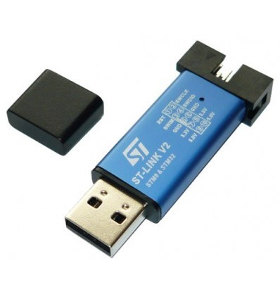
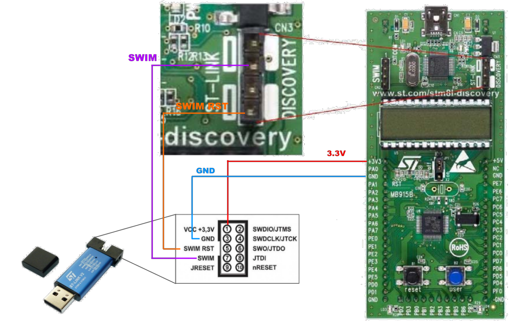
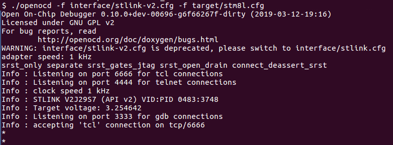

# MCU_Experiments

Amazing experiments with microcontroller STM8L151 using an [STM8L-Discovery development board](https://www.st.com/en/evaluation-tools/stm8l-discovery.html), [Jupyter Notebook](https://jupyter.org/), [OpenOCD](http://openocd.org/) and [**REMCU lib**](https://remotemcu.com)

### stm8l_discovery_GPIO_Toggle
It is a sample of working wit GPIO of STM8L-Discovery board.

### stm8l_discovery_LCD_example
It is a sample of working wit LCD screen of STM8L-Discovery board. You can use the  
```cpp
void LCD_print(std::string str);
```
function and print a message on the LCD screen.


### stm8l_discovery-DMA
It is a sample that demonstrates how to use the Direct Memory Access (DMA) in the STM8L. It is provided that shows how to use the DMA with the ADC and DAC using the various transfer modes of the DMA. This notebook capture ADC data on PC7 pin of STM8L-Discovery and generate a table siganl on PF0 pin using the DAC module of STM8L-Discovery simultaneously.

Russian description  

English description : in proccess... Perhaps [**REMCU tutorial**](https://remotemcu.com/tutorials) can help you run these notebooks.

## Prerequirements
### Hardware
 * MacOS or Linux x64 computer or virtual machine.
 * An [STM8L-Discovery development board](https://www.st.com/en/evaluation-tools/stm8l-discovery.html) or another board with STM8L151
 * ST-Link device. It is a programmer and debugger for STM8 and STM32 chips.
 
 * 4 wires to connect ST-Link with STM8L-Discovery and USB cable to connect the Discovery board with your PC.
 * An oscilloscope to display analog waves and a signal generator for ADC testing. It is optional.


### Software
 * [Anaconda Distribution](https://www.anaconda.com/distribution/) with install [xeus-cling](https://github.com/jupyter-xeus/xeus-cling) and [xplot](https://github.com/QuantStack/xplot) packages.
 * OpenOCD prebuild [package](https://github.com/ilg-archived/openocd/releases/tag/v0.10.0-12-20190422)
 * REMCU library for STM8L151. Download the necessary version of REMCU Lib from [**download page**](https://remotemcu.com/download):  
Target - **STM8L152C6**  
Library - **StdPeriph_Lib**  
Version - **1.4.0**  
Operation system - **MacOS/Linux**


## Prepare
Connect the st-link to the development board using the scheme:  

Connect the st-link to PC  
Run OpenOCD utility:
""

## Running
Execute notebook cells and look at the results
